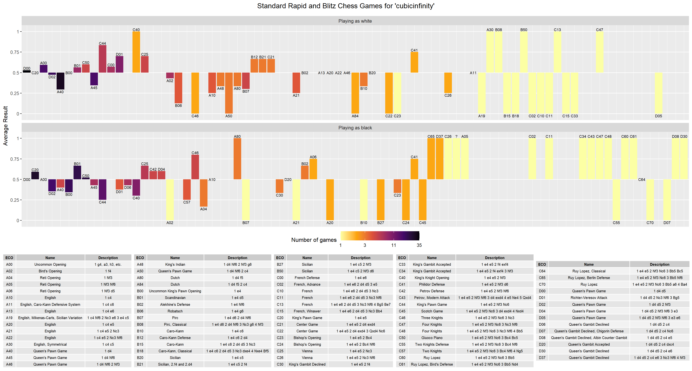

# tidy_lichess - 1.0.2
### Analyze your lichess games

---

Lichess.org already offers a nice collection of analysis tools players can use to understand their performance.  
This repository provides the basic tools to perform your own research on chess games data with the limitless potential of R.

---

UPDATE: The stockfish package was removed from CRAN in 2023. 
It is still available at `install.packages('https://cran.r-project.org/src/contrib/Archive/stockfish/stockfish_1.0.0.tar.gz')` or `remotes::install_github("curso-r/stockfish")`.
This bundles Stockfish 14.1. For the latest version, pass a [downloaded stockfish](https://stockfishchess.org/download/) executable to `fish$new()`.

---

`count_material.R` includes a customizable `material_score()` for FEN positions.

Version 1.0.2 adds example content for processing positions with Stockfish and saving the evaluations for all positions of games in long format.
See `evaluate_games.R` and its dependencies. This engine analysis content works properly, but I intend to improve it further.

---

The most advanced feature of this repo is the `fen_move` function, which gets the 
next FEN position in chess, given the current FEN position and the algebraic 
move. Thus, allowing you to recreate every position in the game and save them in tibbles.  
https://en.wikipedia.org/wiki/Forsyth%E2%80%93Edwards_Notation  
https://en.wikipedia.org/wiki/Algebraic_notation_(chess)

`fen_move` supports a number of variants, namely,  
Standard (Including From Position)  
Crazyhouse    
Chess960  
Three-check  
King of the Hill  
Horde

I plan to add support for some other variants in the future. Atomic, Duck, and Anti-Chess are the most likely to be added.

---

AnalysisDemo.R is an example script for building an opening performance plot:

I should work on my queen pawn openings.

---

The license is GPL v3 +.

You are welcome to contribute to this project. Communicating with me will improve efficiency.
